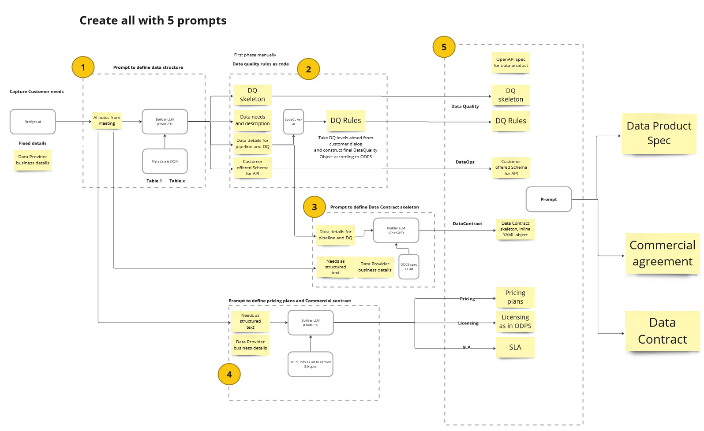

# Initial PoC of Data Product LLM

The plan is to leverage Large Language Models (LLMs) to automate the generation of data product specifications, data contracts, and commercial agreements. 

We should be able to create all with 5 iterated and well-planned prompts. Suggested execution plan to effectively use LLMs for this purpose:

## Analysis

**Capture Customer Needs:**
Input: This starts with capturing customer needs using tools like Firefly.ai.
Role of LLMs: LLMs can be used to analyze structured notes from meetings and convert them into actionable insights or prompts for further processing.

**Restructuring Needs:**
Process: Once customer needs are captured, the next step involves restructuring these needs into structured text.
Role of LLMs: LLMs can be used to process and structure raw customer feedback into more formal, structured text that can be used in subsequent stages.

**Defining Data Structure:**
Input: The restructured needs are used to define the data structure, including creating metadata in JSON, table definitions, etc.
Role of LLMs: LLMs can assist in generating the data schema based on the input requirements, ensuring it aligns with customer-provided schemas or ODPS standards.

**Data Quality (DQ) Rules:**
Input: The data quality rules are derived from customer dialogue and existing standards.
Role of LLMs: LLMs can generate initial DQ rules based on customer inputs and predefined skeletons, which can be refined by data engineers.

**Pricing Plans:**
Input: Customer needs are structured to define pricing plans according to ODPS format.
Role of LLMs: LLMs can draft pricing plans that align with customer requirements and industry standards, allowing for easy customization.

**Commercial Contract Skeleton:**
Input: The commercial contract skeleton needs to follow the ODPS format.
Role of LLMs: LLMs can be used to generate the skeleton of commercial contracts, including licensing terms and SLAs.

**Data Contract Skeleton:**
Input: Data contract skeletons are created in ODCS format.
Role of LLMs: LLMs can draft data contracts based on customer inputs, adhering to ODCS standards.

**Output:**
The output of this process includes:
1. Data Product Specification
2. Commercial Agreement
3. Data Contract

## Execution Plan

**Phase 1: Initial Setup**
Task: Identify and configure the required LLMs (e.g., GPT-4) with drafted custom prompts tailored for each specific task (data product specs, contracts, etc.).
Deliverables: Setup of LLMs with predefined templates and prompts.

**Phase 2: Capturing and Structuring Customer Needs**
Task: Use Firefly.ai to record 3 conversions as material for the process.  
Task: Prompt to extract and restructuring of customer needs into structured text.
Deliverables: A structured document that contains customer requirements, ready for further processing.

**Phase 3: Automated Data Structure Definition**
Task: Utilize LLMs to generate the data schema and structure based on customer-provided needs and metadata.
Deliverables: JSON schemas, table definitions, and metadata aligned with ODPS standards.

**Phase 4: Data Quality Rule Generation**
Task: Develop DQ skeletons and rules using LLMs, incorporating customer data quality requirements.
Deliverables: A set of data quality rules ready for implementation in the data pipeline.

**Phase 5: Pricing Plan Development**
Task: Generate pricing plans using LLMs that align with customer needs and ODPS standards.
Deliverables: Pricing plan documents ready for review and finalization.

**Phase 6: Commercial Contract and Data Contract Generation**
Task: Use LLMs to draft skeletons for commercial agreements and data contracts, including licensing and SLAs.
Deliverables: Drafts of commercial agreements and data contracts ready for legal review.

**Phase 7: Review and Iteration**
Task: Review the outputs generated by LLMs with stakeholders (legal, data engineers, product managers) to ensure they meet the required standards.
Deliverables: Finalized documents that are ready for client delivery.

**Phase 8: Integration and Automation**
Task: Integrate the LLM-generated outputs into the overall data product lifecycle and automate the process for future iterations.
Deliverables: A fully automated system that can capture, process, and deliver data products, contracts, and pricing plans with minimal human intervention.